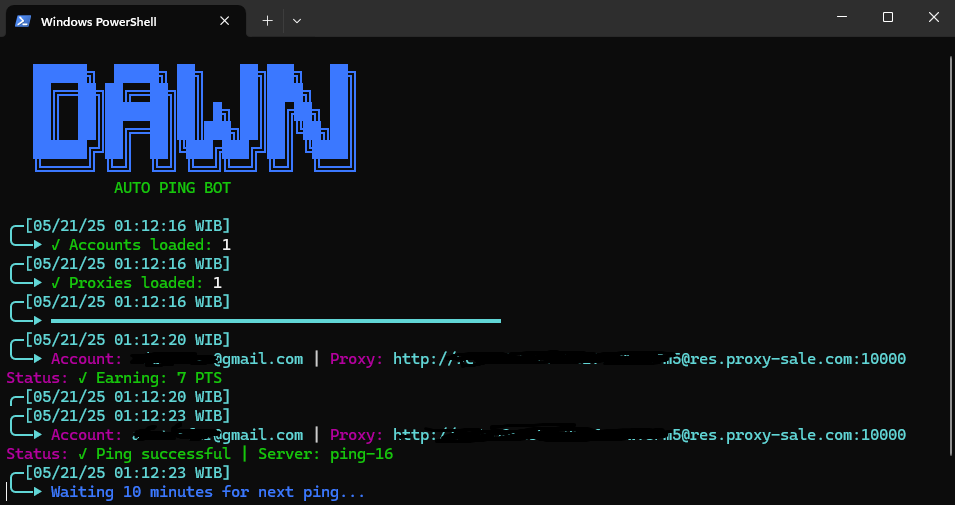

# Dawn Validator BOT
Dawn Validator BOT



- Download Extension Here : [Dawn Validator](https://chromewebstore.google.com/detail/dawn-validator-chrome-ext/fpdkjdnhkakefebpekbdhillbhonfjjp?hl=en)
- Use Code : 7hvpd3yt

## Features

  - Auto Get Account Information
  - Auto Run With Private Proxy - Choose 2 # [**GET HIGH QUALITY CHEAP RESIDENTIAL PROXIES FROM HERE**](https://proxy-sale.com/?partner_link=7w04Ij8gwl)
  - Auto Run Without Proxy - Choose 3
  - Auto Send Keep-Alive Every 5 Minutes
  - Multi Accounts With Threads

Note: Dawn Server may be experiencing problems receiving requests, please be patient.

## Installation

1. **Clone The Repositories:**
   ```bash
   git clone https://github.com/Not-D4rkCipherX/DAWN.git
   cd DAWN
   pip install -r requirements.txt
   ```

## Getting Token
- Open ``The DAWN Extension`` in your browser and login
- Press F12 or CTRL+SHIFT+I and Select Network
- Look for ``getpoint?appid=``
- Open request headers and copy the token. Bearer ``a1b2c3d4ef5g`` < your token

- Insert your account details in ``accounts.json``, with each line in the format for each account, like:
```
nano accounts.json
```
  ```bash
  [
      {
          "Email": "your_email_address 1",
          "Token": "your_berear_token 1"
      },
      {
          "Email": "your_email_address 2",
          "Token": "your_berear_token 2"
      }
  ]
  ```
## PROXY (OPTINAL)
```
nano proxy.txt
```
- Make sure `proxy.txt` contains data that matches the format expected by the script. Here are examples of file formats:
  ```bash
    ip:port # Default Protcol HTTP.
    protocol://ip:port
    protocol://user:pass@ip:port
  ```

## Run the BOT

```bash
python bot.py #or python3 bot.py
```
